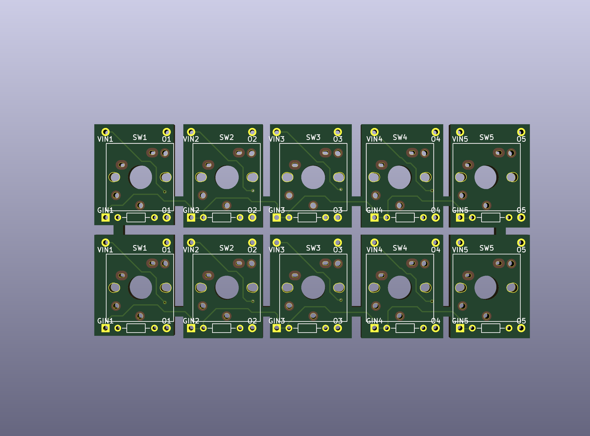
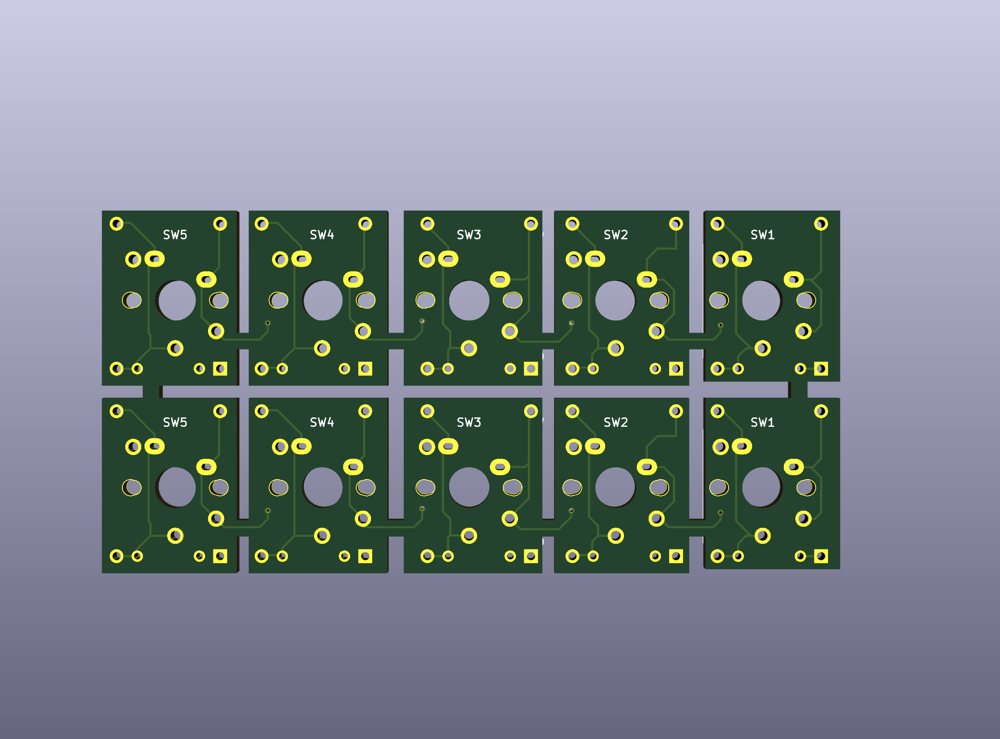

# 自作キーボードのスイッチをユニバーサル基板でも使うための変換基板

[回路図 ./circuit-diagram.pdf](./circuit-diagram.pdf)

- 2.54 ピッチで間隔ではまるピン配置。
- Cherry MX 互換スイッチと、Kailh Choc V1/2 スイッチに対応する。
- 入力値となる VIN は VIN1~5 でつながっているため、どれか一つを GND or VCC につなげば良い。
- PULL UP/PULL DOWN 抵抗と、PULL UP/PULL DOWN のための入力をもつ。VIN とは異なる GND or VCC につなげば良い。
- GIN も GIN1~5 でつながっているため、どれか一つを GND or VCC につなげば良い。

## 継承使用ライブラリ

- [https://github.com/keebio/Keebio-Parts.pretty](https://github.com/keebio/Keebio-Parts.pretty)
- [https:///github.com/foostan/kbd](https:///github.com/foostan/kbd)

## ライセンス

[CC BY 4.0](hhttps://creativecommons.org/licenses/by-sa/3.0/deed.jp]
